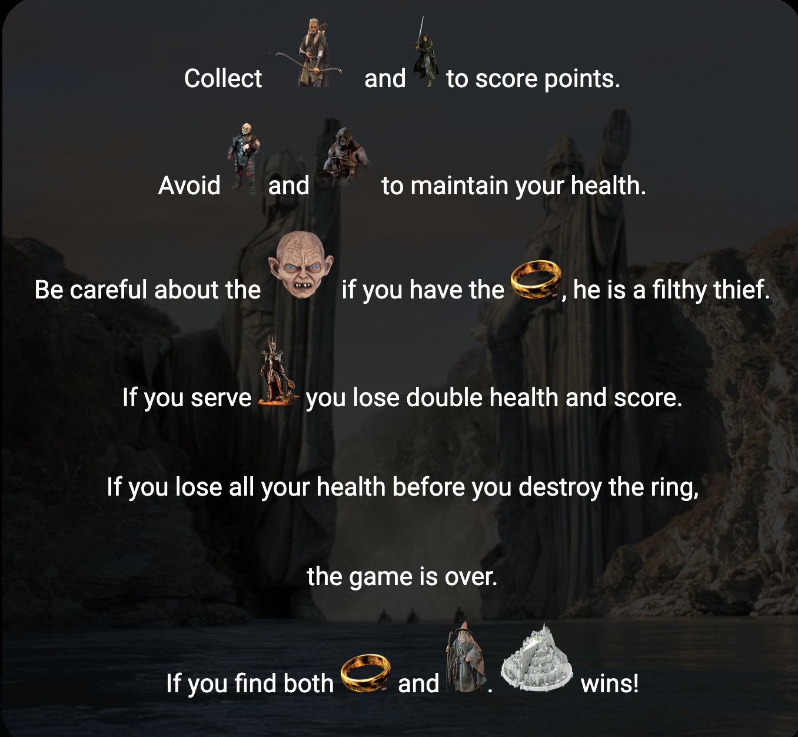
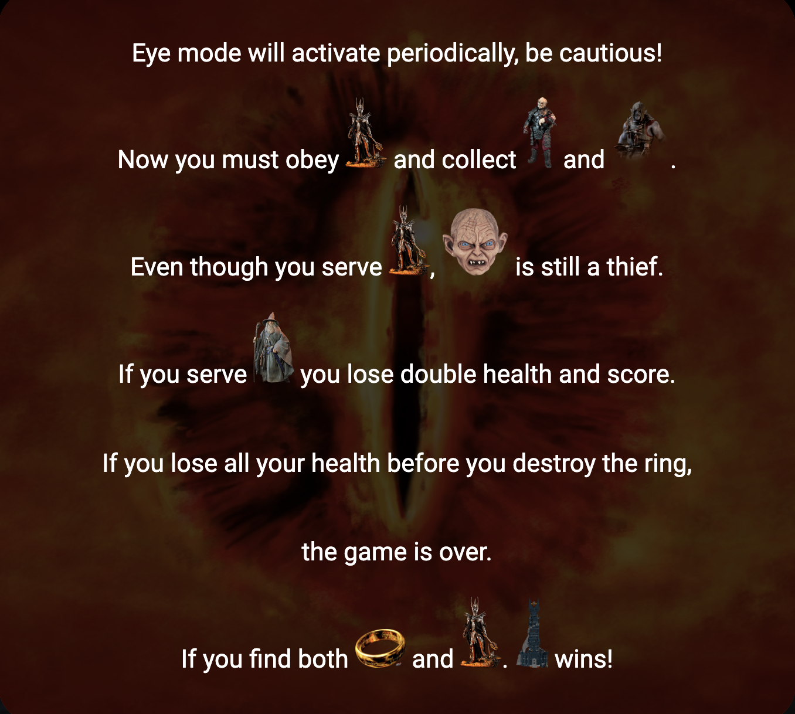

# Hotel Middle Earth Game

Welcome to Hotel Middle Earth! This is a fullscreen browser-based game where you collect visitors, make choices, and aim for the highest score. Be strategic, avoid enemies, and have fun exploring the Middle Earth universe.

## Demo

https://utkucikmaz.github.io/Hotel-Middle-Earth/

## Introduction

Hotel Middle Earth is a game developed using HTML, CSS, and JavaScript. It is designed to challenge your decision-making skills, focus and reflexes while immersing you in the fantasy world of Middle Earth.

## Features

-   Collect visitors of various types to score points.
-   Avoid certain visitors to maintain your health.
-   Encounter special characters like Gandalf, Sauron, and Gollum.
-   Activate "Eye Version" periodically for an added challenge.
-   Store and display top player scores using Firebase.
-   Enjoy a fun and engaging user interface.

## Instructions to Play

There are two different screens in the game that activate periodically and they have their own rules.

